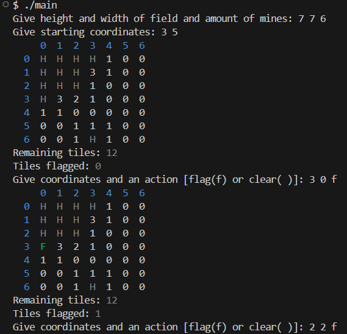

# Minesweeper

## A simple and native cross-platform Minesweeper game made with C++ and wxWidgets

The program is a basic Minesweeper game that allows you to set an arbitrary grid size and number of mines.

The program has an Graphical User Interface made with wxWidgets.

The game ensures that the first clicked square is never a bomb, and allows you to reveal surrounding tiles when the number of placed flags matches the number on the tile.

The image assets are all original and hand-made.

## Development
This project was developed as a programming assignment by Veeti Velin and Miikka Tervo.

The application was developed using C++ Standard Libraries and [wxWidgets UI Library](https://wxwidgets.org/), and was compiled using the [CMake Build System](https://cmake.org/) with 
a modified version of the [wxWidgets CMake template](https://github.com/lszl84/wx_cmake_fetchcontent_template) mady by [lszl84](https://github.com/lszl84). 

## Terminal Version

The project also includes a simple version of the game that runs in the terminal using Makefile.

